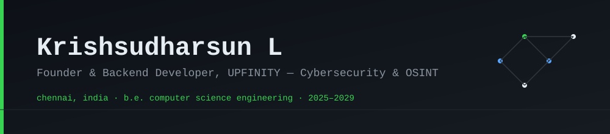
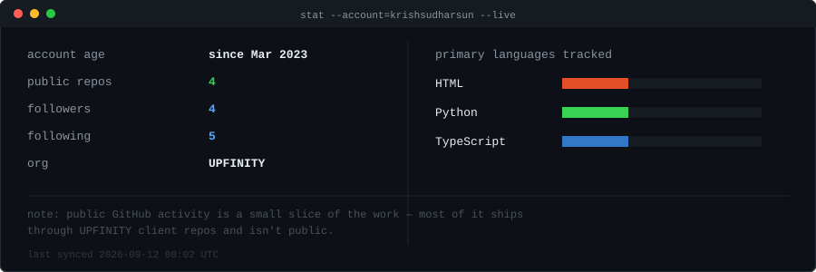
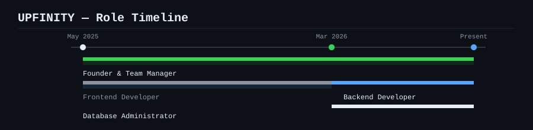
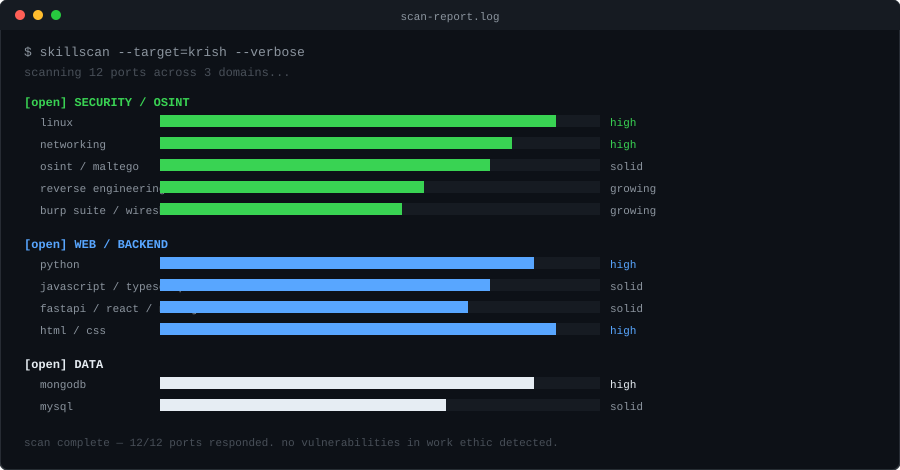

<div align="center">
  
</div>

<p align="center">
  <a href="https://linkedin.com/in/krishsudharsun-l-483525277"></a>
  <a href="mailto:lkrishsudharsun08@gmail.com"></a>
  
</p>

<p align="center"><sub>this profile is a shell session. click the commands below to run them.</sub></p>

---

<details open>
<summary><code>$ cat about.md</code></summary>
<br>

I run **UPFINITY** — leading project execution, client delivery, and the backend/database side of things. Outside of that, I spend most of my time on the security side: Linux, networking, OSINT, and slowly working through bug bounty and reverse engineering.

I don't think of myself as "a developer who also likes security" — it's closer to the reverse. Backend work is where the paycheck is; figuring out how systems break is where the curiosity is.

</details>

<details>
<summary><code>$ stat --account=krishsudharsun</code></summary>
<br>

<div align="center">
  
</div>

</details>

<details>
<summary><code>$ git log --graph --oneline upfinity/</code></summary>
<br>

<div align="center">
  
</div>

</details>

<details>
<summary><code>$ skillscan --target=krish --verbose</code></summary>
<br>

<div align="center">
  
</div>

</details>

<details>
<summary><code>$ ls -la ~/case-studies/</code></summary>
<br>

```
drwxr-xr-x  osint-investigation-case-study/     applied OSINT methodology, structured intel gathering
drwxr-xr-x  vuln-research-bugbounty-practice/   hands-on vulnerability discovery, live practice
drwxr-xr-x  ecommerce-platform/                 full-stack: frontend UX + backend logic
```

</details>

<details>
<summary><code>$ cat education.log</code></summary>
<br>

```
B.E. Computer Science Engineering
Misrimal Navajee Munoth Jain Engineering College
2025 – 2029 (in progress)  |  CGPA 7.57/10

certifications:
  - Introduction to Cybersecurity, Simplilearn (2025)
  - HTML Fundamentals, Sololearn (2025)
```

</details>

<details>
<summary><code>$ tail -f currently-learning.log</code></summary>
<br>

`bug bounty` `threat intelligence` `linux internals` `reverse engineering` `backend at scale` `osint tradecraft`

</details>

<details>
<summary><code>$ cat contact.txt</code></summary>
<br>

```
email     lkrishsudharsun08@gmail.com
linkedin  linkedin.com/in/krishsudharsun-l-483525277
location  Chennai, India
status    open to interesting problems
```

</details>

---

<div align="center">
  <sub><code>$ ping krish</code> — response time: usually same day</sub>
</div>

<div align="center"><sub><!-- LAST_SYNCED_START --> last synced: `2026-08-31 09:58 UTC` <!-- LAST_SYNCED_END --></sub></div>
